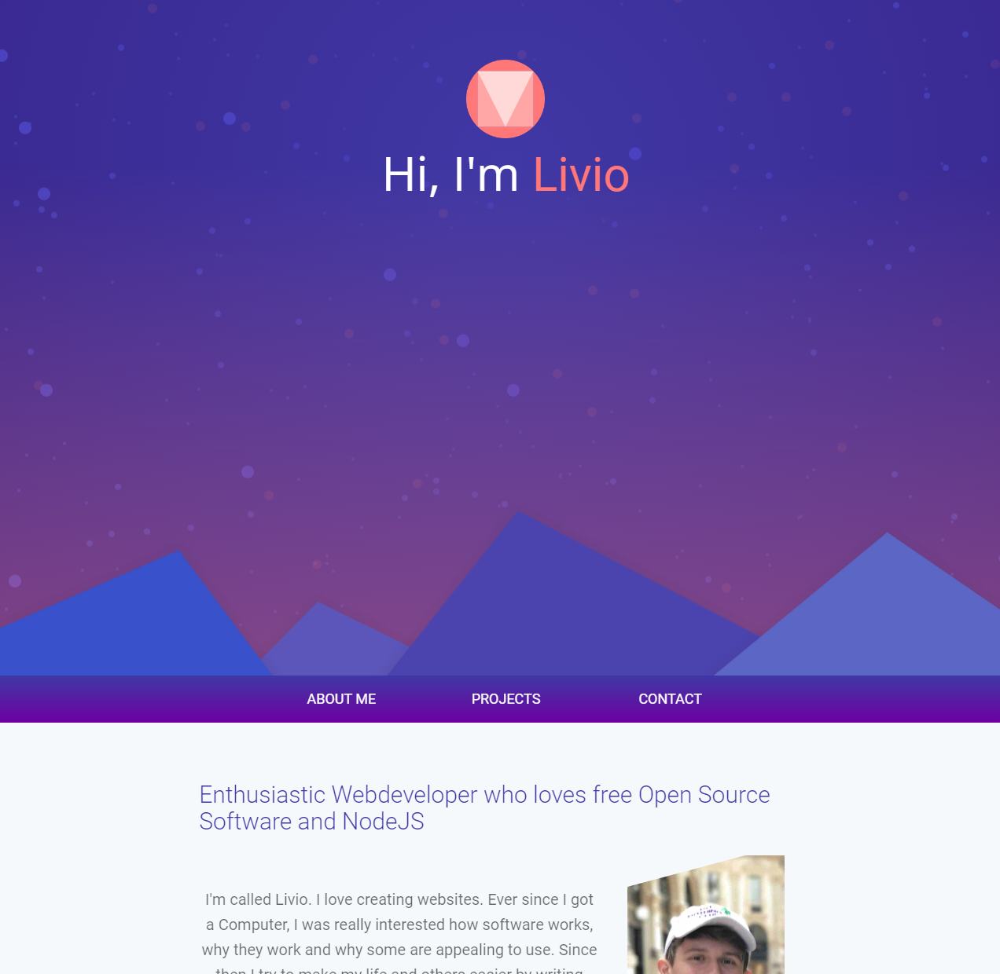

With this article I want to dissect my personal website as well as sharing some learnings.

## Getting my inspiration

My main inspiration for my portfolio which is still present to this day is the [Reddit User Analyzer](https://reddit-user-analyser.netlify.app/). It's an absolutely phenomenally designed website with a beautiful color scheme. I loved the color composition so much that I even asked the Reddit user who created it whether I can adopt it.

